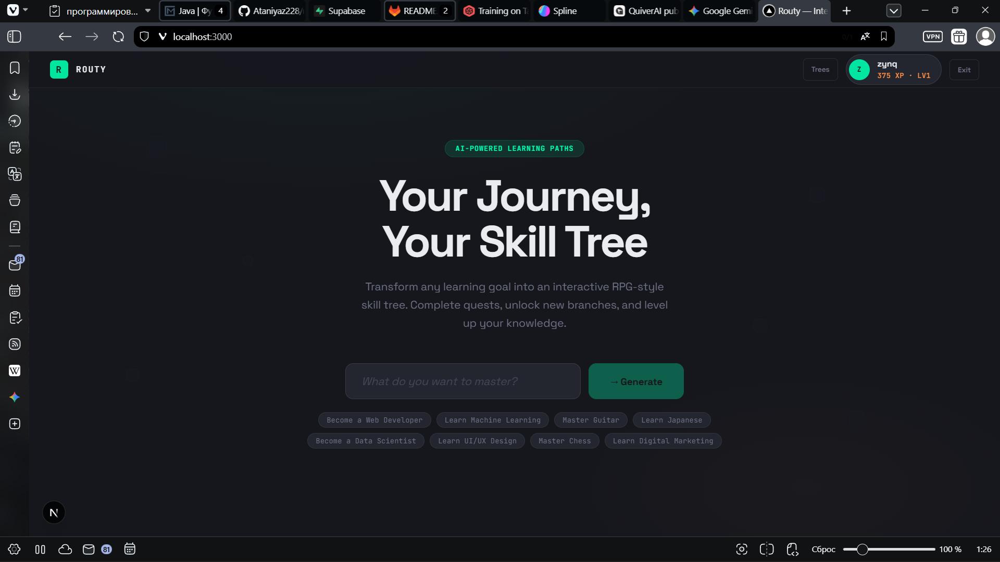
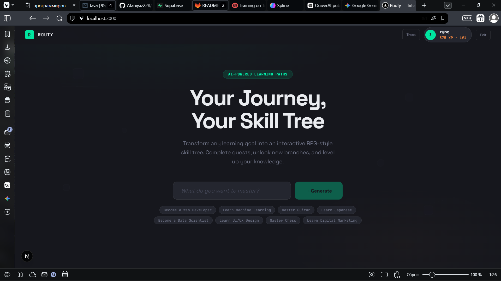

<div align="center">

<!-- LOGO PLACEHOLDER: Replace with your logo -->
<!--  -->

# R O U T Y

**AI-powered skill trees that turn learning into a quest.**

[](https://nextjs.org/)
[](https://reactflow.dev/)
[](https://www.postgresql.org/)
[](https://www.typescriptlang.org/)
[](./LICENSE)

</div>

---

## Demo

<!-- DEMO VIDEO PLACEHOLDER -->
<!-- Replace the src below with your hosted video/GIF URL -->
<div align="center">

<!--

-->

> **[ Demo video / GIF placeholder ]** — Record a screen capture of generating a skill tree in real time and place it here.

</div>

---

## Screenshots

<!-- SCREENSHOT GALLERY — Replace placeholder paths with actual image URLs -->
<table>
  <tr>
    <td width="50%" align="center">
      
      <strong>[ Dashboard ]</strong><br/>
      <sub>Manage all your skill trees in one place</sub>
    </td>
    <td width="50%" align="center">
      
      <strong>[ Graph View ]</strong><br/>
      <sub>Interactive node graph with RPG-inspired visual states</sub>
    </td>
  </tr>
</table>

---

## Core Features

### Intelligent Graph Generation
- Define a learning goal in natural language; the AI constructs a structured, dependency-aware skill tree
- Strict prerequisite enforcement: topics are ordered from foundational to advanced
- Single entry point architecture with depth-first progression

### Visual Hierarchy
- **Main Path** nodes form the primary learning route with full visual weight
- **Side Quest** nodes (expanded via deep dives) are visually deprioritized — smaller, translucent, dashed borders
- Edges adapt dynamically: solid lines for core paths, dashed lines for optional branches

### Boss Fights (Project Milestones)
- Periodic project nodes replace theory with practical briefs — build something real
- Golden border with pulsing glow animation distinguishes bosses from regular nodes
- Difficulty rated 3-5 with clear acceptance criteria

### Knowledge Verification
- AI-generated binary quiz before marking any node as complete
- Lightweight model handles quiz generation for fast response times

### Resource Loot
- Each node carries 1-2 curated links to official documentation and tutorials
- Rendered as interactive cards in the detail panel

### Macro-Goals (Command Bar)
- Press `/` to open a Spotlight-style input for new macro-directions
- AI discovers the deepest logical anchor node and generates a contextual branch
- Auto-zoom to newly created nodes

### Guardrails
- Input validation rejects nonsense, off-topic, prompt injection, and prohibited content
- AI responds with structured error messages, guiding users back on track

---

## Tech Stack

| Layer | Technology | Purpose |
|:------|:-----------|:--------|
| **Frontend** | Next.js 16, React 19, TypeScript | Application shell and routing |
| **Graph Engine** | @xyflow/react (React Flow) | Interactive node/edge rendering with drag, zoom, pan |
| **Styling** | Vanilla CSS, CSS Variables | Premium dark theme with design tokens |
| **Backend** | Next.js API Routes | RESTful endpoints for CRUD and AI orchestration |
| **Database** | PostgreSQL | Persistent storage for users, trees, nodes, edges |
| **AI Engine** | OpenAI-compatible API | Structured JSON generation for graphs, quizzes, branches |
| **Auth** | JWT (jose) | Stateless session management |

---

## Getting Started

### Prerequisites

- Node.js 18+
- PostgreSQL 14+
- An OpenAI-compatible API endpoint

### Installation

```bash
git clone https://github.com/Ataniyaz228/routy.git
cd routy
npm install
```

### Environment

Copy the example file and fill in your values:

```bash
cp .env.example .env.local
```

> **Required variables:** database credentials, AI API base URL and key, JWT secret. See `.env.example` for the full list.

### Database

```bash
psql -U postgres -c "CREATE DATABASE routy;"
psql -U postgres -d routy -f scripts/init-db.sql
```

### Run

```bash
npm run dev
```

Open `http://localhost:3000` — register, enter a learning goal, and watch the graph generate.

---

## Project Structure

```
routy/
  scripts/
    init-db.sql           # Database schema
  src/
    app/
      api/
        auth/             # JWT authentication
        generate-tree/    # AI tree generation
        expand-node/      # Branch expansion
        macro-expand/     # Macro-goal anchor discovery
        node/             # Complete, quiz, position, delete
      dashboard/          # Tree list
      tree/[id]/          # Graph canvas page
    components/
      SkillTreeCanvas.tsx  # Main graph canvas + command bar
      SkillNode.tsx        # Custom node renderer
      NodeDetailPanel.tsx  # Side panel with theory/resources
      QuizModal.tsx        # Knowledge verification modal
    lib/
      ai.ts               # AI prompts and generation logic
      db.ts               # PostgreSQL connection pool
      auth.ts             # JWT utilities
      types.ts            # Core type definitions
      tree-utils.ts        # Layout engine and flow conversion
```

---

## License

MIT

---

---

<div align="center">

# R O U T Y

**Граф навыков на базе ИИ, превращающий обучение в квест.**

</div>

---

## Демо

<!-- ПЛЕЙСХОЛДЕР ДЕМО-ВИДЕО -->
<div align="center">

<!--

-->

> **[ Плейсхолдер для демо-видео / GIF ]** — Запишите скринкаст генерации дерева навыков в реальном времени и вставьте сюда.

</div>

---

## Скриншоты

<table>
  <tr>
    <td width="50%" align="center">
      <!--  -->
      <strong>[ Дашборд ]</strong><br/>
      <sub>Управление всеми деревьями навыков</sub>
    </td>
    <td width="50%" align="center">
      <!--  -->
      <strong>[ Вид графа ]</strong><br/>
      <sub>Интерактивный граф с RPG-визуалом состояний</sub>
    </td>
  </tr>
  <tr>
    <td width="50%" align="center">
      <!--  -->
      <strong>[ Панель теории ]</strong><br/>
      <sub>Подробный учебный контент со ссылками на ресурсы</sub>
    </td>
    <td width="50%" align="center">
      <!--  -->
      <strong>[ Босс-нода ]</strong><br/>
      <sub>Проектные вехи с практическими ТЗ</sub>
    </td>
  </tr>
</table>

---

## Ключевые механики

### Интеллектуальная генерация графа
- Задайте цель обучения на естественном языке — ИИ построит структурированное дерево с учетом зависимостей
- Строгий контроль пререквизитов: темы выстраиваются от фундамента к продвинутым
- Единая точка входа с приоритетом глубины над шириной

### Визуальная иерархия
- Узлы **основного пути** формируют первичный маршрут с полным визуальным весом
- Узлы **побочных квестов** (углубление через expand) визуально приглушены — меньше, прозрачнее, пунктирные рамки
- Связи адаптируются динамически: сплошные линии для основных путей, пунктир для опциональных веток

### Босс-файты (Проектные вехи)
- Периодические проектные ноды заменяют теорию практическим ТЗ — создайте что-то реальное
- Золотая рамка с пульсирующим свечением отличает боссов от обычных узлов
- Сложность 3-5 с четкими критериями приемки

### Верификация знаний
- ИИ-генерируемый бинарный вопрос перед отметкой любого узла как пройденного
- Легковесная модель для генерации вопросов обеспечивает быстрый отклик

### Ресурсы (Лут)
- Каждый узел содержит 1-2 курированные ссылки на официальную документацию и туториалы
- Отображаются как интерактивные карточки в панели деталей

### Макро-цели (Командная строка)
- Нажмите `/` для вызова Spotlight-подобного поля ввода новых макро-направлений
- ИИ находит глубочайший логический якорный узел и генерирует контекстную ветку
- Автоматический зум к свежесозданным узлам

### Гардрейлы
- Валидация ввода отклоняет бессмыслицу, офф-топик, prompt injection и запрещенный контент
- ИИ отвечает структурированными сообщениями об ошибках, направляя пользователя

---

## Технологический стек

| Слой | Технология | Назначение |
|:-----|:-----------|:-----------|
| **Фронтенд** | Next.js 16, React 19, TypeScript | Каркас приложения и маршрутизация |
| **Граф-движок** | @xyflow/react (React Flow) | Интерактивный рендеринг узлов и связей |
| **Стилизация** | Vanilla CSS, CSS Variables | Премиальная темная тема с дизайн-токенами |
| **Бэкенд** | Next.js API Routes | REST-эндпоинты для CRUD и оркестрации ИИ |
| **База данных** | PostgreSQL | Хранение пользователей, деревьев, узлов, связей |
| **ИИ-движок** | OpenAI-совместимый API | Структурированная JSON-генерация графов, вопросов, веток |
| **Аутентификация** | JWT (jose) | Stateless-управление сессиями |

---

## Установка и запуск

### Требования

- Node.js 18+
- PostgreSQL 14+
- OpenAI-совместимый API-эндпоинт

### Установка

```bash
git clone https://github.com/Ataniyaz228/routy.git
cd routy
npm install
```

### Окружение

Скопируйте пример и заполните значения:

```bash
cp .env.example .env.local
```

> **Обязательные переменные:** реквизиты БД, базовый URL и ключ AI API, JWT-секрет. Полный список в `.env.example`.

### База данных

```bash
psql -U postgres -c "CREATE DATABASE routy;"
psql -U postgres -d routy -f scripts/init-db.sql
```

### Запуск

```bash
npm run dev
```

Откройте `http://localhost:3000` — зарегистрируйтесь, введите цель обучения и наблюдайте генерацию графа.

---

## Лицензия

MIT
